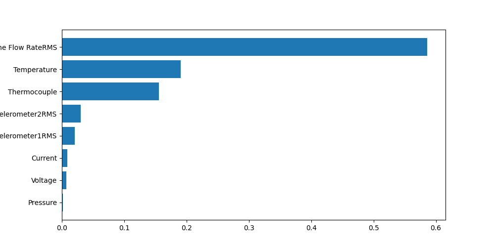
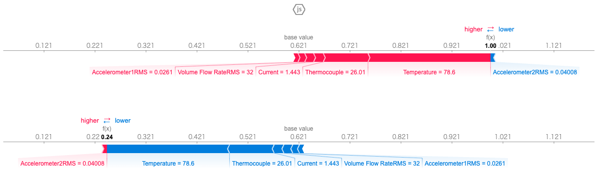

# 生産管理 中間レポート
> 中央大学理工学部   
> ビジネスデータサイエンス学科  
> 23D7104001I 髙木悠人  

## 1.	実行環境
本課題では、以下の環境で実行・分析した。

| 項目                 | 内容                                                                 |
|----------------------|--------------------------------------------------------------------|
| PC (notebook)        | Apple macbook air m4                                              |
| Python環境           | venv仮想環境（ローカルでの実行）                                    |
| Pythonバージョン     | python-3.13.9                                                     |
| 各種パッケージバージョン | requirements.txtリンクは付録の項に示すこととした                    |
| コードバージョン管理   | GitHub（リンクは付録の項に示すこととした）                         |

## 2.	課題1
### (ア)	課題概要
SKABデータについてXGBoostを用いてモデル構築を行い，RandomForestの変数重要度，SHAP値と比較してどのような違いがあるか検証を行え．また，可能であればSVMなど他の予測モデルで予測を行った結果と比較を行い，予測に効く変数が検討したモデルでどのように異なるか考察を行え．

### (イ) 分析方針

本分析は、以下の詳細な手順に従って進めた。
cc
#### ① SKABデータの取得と前処理

- GitHubのオープンデータリポジトリから、SKAB（Server Machine Dataset）のcsvファイル形式データをダウンロードした。
- 得られた複数のcsvファイルをpandasを用いてDataFrameとして読み込み、行方向（縦方向）に結合してひとつのデータセットとした。
- 分析に不要なカラムである「datetime」列と「changepoint」列を削除した。また、必要に応じて欠損値の有無確認と簡易的な前処理（型変換・欠損値補完）を実施した。
- 目的変数（target）のラベルバランスも確認し、極端な不均衡がないことを確認した。

#### ② XGBoostモデルの構築およびハイパーパラメータ最適化

- XGBoostを使用し、特徴量をもとに異常検知タスクの分類モデルを構築した。
- Optuna（自動ハイパーパラメータ探索ライブラリ）と連携し、`n_estimators`, `max_depth`, `learning_rate` など主要なハイパーパラメータを最適化した。最適化指標にはクロスバリデーションでのAUCまたはF1スコアを利用した。
- 得られた最適モデルについて、学習データと検証データそれぞれの評価指標（AUC・F1・混同行列など）を算出し、過学習の有無もチェックした。

#### ③ RandomForestモデルの構築

- sklearnのRandomForestClassifierを用いて、XGBoostとパラメータを揃える形でモデルを新たに構築した。
- ハイパーパラメータ調整にはGridSearchCVも併用し、最適な木の数や深さなどを探索した。
- 学習済みモデルから、組み込みの「feature_importance_」を取得し、変数重要度を可視化・定量評価した。

#### ④ SVM（サポートベクターマシン）モデルの構築

- sklearnのSVCを活用し、他の2モデルと同じ前処理・特徴量でモデルを構築した。
- RBFカーネルを主に用い、主要ハイパーパラメータ（`C`, `gamma`など）はグリッドサーチで最適化した。
- SVMの特性上、特徴量のスケーリング（StandardScalerを使用）を事前に行った。

#### ⑤ モデルごとのSHAP値・変数重要度比較と解釈

- XGBoostおよびRandomForestについてはSHAP（SHapley Additive exPlanations）で特徴量の寄与度（グローバル・ローカル両視点）を可視化した。
- 変数重要度のランキングや、各モデルで重要とみなされた特徴量の違いを比較検討した。

#### ⑥ 比較・考察の準備

- 各モデルの評価指標（AUC, F1, 精度, 再現率など）とともに、出力された変数重要度・SHAP値・可視化グラフを整理した。
- モデル間での重要特徴量の共通点や相違点、精度や解釈性の観点からの比較ポイントをまとめ、次節の考察に繋げられるようにした。

### (ウ) 分析結果

上記の方針・手順に従い、詳細な分析結果（モデルごとのスコア・重要変数の違い・グラフ等）を以下に示す。

#### XGBoostモデルの構築結果
XGBoostを用いて分析した結果を以下に示す。

上記の図は、変数重要度を可視化したものである。これを見ると、エンジン温度(Themperature)と循環水の温度(Thermocouple)、循環水の流量(Volume Flow RateRMS)が、

### (エ)	考察

## 3.	課題2
### (ア)	分析方針
### (イ)	分析結果
### (ウ)	考察

## 4.	参考文献
